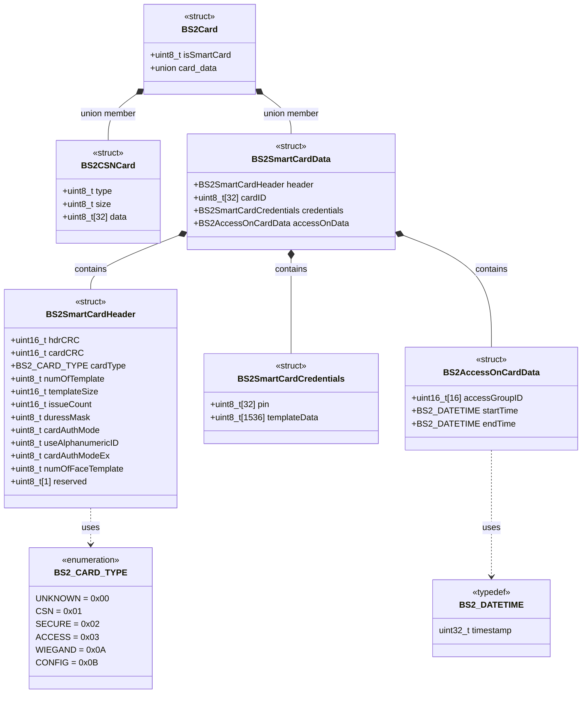

import TypedefStruct from '@site/src/components/TypedefStruct';

# Smartcard API

카드 데이터를 읽고 쓰는 함수를 제공하는 API입니다.

**주요 함수**

- **[BS2_ScanCard](https://kb.supremainc.com/bs2sdk/doku.php?id=ko:bs2_scancard)**: 장치에서 카드를 스캔하고 카드 데이터를 분석합니다.

- **[BS2_WriteCard](https://kb.supremainc.com/bs2sdk/doku.php?id=ko:bs2_writecard)**: SmartCard에 데이터를 저장합니다.

- **[BS2_EraseCard](https://kb.supremainc.com/bs2sdk/doku.php?id=ko:bs2_erasecard)**: SmartCard를 포맷합니다.

## 구조체 관계도



## 구조체


### BS2Card

<TypedefStruct 
  name="BS2Card"
  description="모든 카드 타입을 포괄하는 최상위 구조체입니다."
  category="Core Structure"
  size="1649"
  version="2.8"
  code={`typedef struct {
    uint8_t isSmartCard;
    union {
        BS2CSNCard card;
        BS2SmartCardData smartCard;
    };
} BS2Card;`}
  hierarchy={[
    {
      name: "BS2Card",
      type: "union wrapper",
      size: 1649,
      description: "카드 타입 식별 및 데이터 저장",
      children: [
        {
          name: "isSmartCard",
          type: "uint8_t",
          size: 1,
          description: "스마트카드 여부 플래그"
        },
        {
          name: "Union 데이터",
          description: "카드 타입별 데이터 (동일 메모리 공간 공유)",
          children: [
            {
              name: "card (일반카드)",
              type: "BS2CSNCard",
              size: 35,
              description: "CSN 카드 데이터",
              references: ["BS2CSNCard"]
            },
            {
              name: "smartCard (스마트카드)",
              type: "BS2SmartCardData",
              size: 1648,
              description: "스마트카드 전체 데이터",
              references: ["BS2SmartCardData"]
            }
          ]
        }
      ]
    }
  ]}
  fields={[
    {
      name: "isSmartCard",
      type: "uint8_t",
      size: 1,
      offset: 0,
      description: "SmartCard 여부를 나타내는 flag입니다.",
      constants: [
        { value: "0", description: "일반 CSN 카드 (BS2CSNCard 사용)" },
        { value: "1", description: "스마트카드 (BS2SmartCardData 사용)" }
      ]
    },
    {
      name: "card",
      type: "BS2CSNCard",
      size: 35,
      offset: 1,
      description: "일반 카드 데이터 (isSmartCard가 0일 때 사용)",
      relatedStructs: ["BS2CSNCard"]
    },
    {
      name: "smartCard",
      type: "BS2SmartCardData",
      size: 1648,
      offset: 1,
      description: "SmartCard 데이터 (isSmartCard가 1일 때 사용)",
      relatedStructs: ["BS2SmartCardData"]
    }
  ]}
  dependencies={[
    { name: "BS2CSNCard", type: "struct", description: "CSN 카드 구조체" },
    { name: "BS2SmartCardData", type: "struct", description: "스마트카드 데이터 구조체" }
  ]}
  usedBy={[
    { name: "BS2UserBlob", type: "struct", description: "사용자 정보 구조체" },
    { name: "BS2CardAuthMode", type: "enum", description: "카드 인증 모드" }
  ]}
  notes={[
    "이 구조체는 모든 카드 타입의 최상위 래퍼입니다.",
    "<code>isSmartCard</code> 값에 따라 union의 올바른 멤버에 접근해야 합니다.",
    "메모리 효율성을 위해 union을 사용하여 동일한 메모리 공간을 공유합니다.",
    "union 특성상 card와 smartCard는 동시에 사용할 수 없습니다."
  ]}
/>

### BS2SmartCardData

<TypedefStruct 
  name="BS2SmartCardData"
  description="스마트카드의 모든 데이터를 포함하는 복합 구조체입니다."
  category="Smart Card"
  size="1648"
  version="2.8"
  code={`typedef struct {
    BS2SmartCardHeader header;
    uint8_t cardID[BS2_CARD_DATA_SIZE];
    BS2SmartCardCredentials credentials;
    BS2AccessOnCardData accessOnData;
} BS2SmartCardData;`}
  hierarchy={[
    {
      name: "BS2SmartCardData",
      type: "composite struct",
      size: 1648,
      description: "스마트카드 전체 데이터 컨테이너",
      children: [
        {
          name: "header",
          type: "BS2SmartCardHeader",
          size: 16,
          description: "카드 메타데이터 및 설정",
          references: ["BS2SmartCardHeader"]
        },
        {
          name: "cardID",
          type: "uint8_t[32]",
          size: 32,
          description: "카드 식별자",
          children: [
            { name: "Card ID (AOC)", type: "bytes[0-31]", size: 32, description: "AOC: 전체 32바이트 사용" },
            { name: "Card ID (SCC)", type: "bytes[0-23]", size: 24, description: "SCC: 카드 ID (24바이트)" },
            { name: "Issue Count (SCC)", type: "bytes[24-27]", size: 4, description: "SCC: 발급 횟수" },
            { name: "Timestamp (SCC)", type: "bytes[28-31]", size: 4, description: "SCC: 발급 시간" }
          ]
        },
        {
          name: "credentials",
          type: "BS2SmartCardCredentials",
          size: 1568,
          description: "인증 정보 (PIN, 생체정보)",
          references: ["BS2SmartCardCredentials"]
        },
        {
          name: "accessOnData",
          type: "BS2AccessOnCardData",
          size: 40,
          description: "출입 권한 정보",
          references: ["BS2AccessOnCardData"]
        }
      ]
    }
  ]}
  fields={[
    {
      name: "header",
      type: "BS2SmartCardHeader",
      size: 16,
      offset: 0,
      description: "SmartCard 헤더입니다.",
      relatedStructs: ["BS2SmartCardHeader"]
    },
    {
      name: "cardID",
      type: "uint8_t[BS2_CARD_DATA_SIZE]",
      size: 32,
      offset: 16,
      description: "단말기에서 사용할 카드 식별자입니다. Access on Card의 경우 배열의 32 byte를 Card ID로 사용하고, Secure Credential card는 배열의 24 byte를 Card ID로 사용하게 됩니다. Secure Credential Card(SCC)의 경우, 32 byte는 Card ID(24 bytes), issueCount(4 byte) 그리고 Time Stamp(4 byte)로 채워져야 합니다. 또한, BS2UserBlob 구조체의 cardObjs array가 SC Card로 채워야 하며, SC Card 발급시마다 cardObjs 업데이트 되어야 합니다."
    },
    {
      name: "credentials",
      type: "BS2SmartCardCredentials",
      size: 1568,
      offset: 48,
      description: "pin code나 지문 템플릿이 저장되어 있는 인증 데이터 영역입니다.",
      relatedStructs: ["BS2SmartCardCredentials"]
    },
    {
      name: "accessOnData",
      type: "BS2AccessOnCardData", 
      size: 40,
      offset: 1616,
      description: "AOC 카드에서 사용하는 영역으로 출입 그룹 정보를 가지고 있습니다.",
      relatedStructs: ["BS2AccessOnCardData"]
    }
  ]}
  dependencies={[
    { name: "BS2SmartCardHeader", type: "struct", description: "스마트카드 헤더" },
    { name: "BS2SmartCardCredentials", type: "struct", description: "인증 정보" },
    { name: "BS2AccessOnCardData", type: "struct", description: "출입 권한 데이터" },
    { name: "BS2_CARD_DATA_SIZE", type: "constant", description: "카드 데이터 크기 상수 (32)" }
  ]}
  usedBy={[
    { name: "BS2Card", type: "union", description: "카드 타입 래퍼" }
  ]}
/>

### BS2CSNCard

<TypedefStruct 
  name="BS2CSNCard"
  description="CSN 카드 정보를 담는 구조체입니다."
  category="Card Data"
  size="35"
  version="2.8"
  code={`typedef struct {
    uint8_t type;
    uint8_t size;
    uint8_t data[BS2_CARD_DATA_SIZE];
} BS2CSNCard;`}
  hierarchy={[
    {
      name: "BS2CSNCard",
      type: "struct",
      size: 35,
      description: "CSN 카드 데이터 구조체",
      children: [
        {
          name: "type",
          type: "uint8_t",
          size: 1,
          description: "카드 유형 코드"
        },
        {
          name: "size", 
          type: "uint8_t",
          size: 1,
          description: "데이터 버퍼 크기"
        },
        {
          name: "data",
          type: "uint8_t[32]",
          size: 32,
          description: "카드 템플릿 데이터"
        }
      ]
    }
  ]}
  fields={[
    {
      name: "type",
      type: "uint8_t",
      size: 1,
      offset: 0,
      description: "카드 유형의 코드 값입니다. 카드 유형은 카드 목적을 나타냅니다. 장치에서 서버로 사용자를 전송할 때, Access 카드는 카드에 기록된 정보만으로 동작이 가능하기 때문에 이슈 기록을 유지하는 데에만 사용됩니다.",
      constants: [
        { value: "0x00", description: "알려지지 않은 카드" },
        { value: "0x01", description: "CSN 카드" },
        { value: "0x02", description: "Secure 카드" },
        { value: "0x03", description: "Access 카드" },
        { value: "0x06", description: "QR 코드" },
        { value: "0x0A", description: "Wiegand 카드", note: "BS2WiegandConfig.format (이 형식은 BS2WiegandConfig.CSNIndex 혹은 BS2WiegandConfig.CardMask가 0으로 설정될 때 사용됩니다.)" },
        { value: "0x0B", description: "Config 카드" },
        { value: "0x1A", description: "Wiegand 카드", note: "BS2WiegandMultiConfig.formats[0]" },
        { value: "0x2A", description: "Wiegand 카드", note: "BS2WiegandMultiConfig.formats[1]" },
        { value: "0x3A", description: "Wiegand 카드", note: "BS2WiegandMultiConfig.formats[2]" },
        { value: "0x4A", description: "Wiegand 카드", note: "BS2WiegandMultiConfig.formats[3]" },
        { value: "0x5A", description: "Wiegand 카드", note: "BS2WiegandMultiConfig.formats[4]" },
        { value: "0x6A", description: "Wiegand 카드", note: "BS2WiegandMultiConfig.formats[5]" },
        { value: "0x7A", description: "Wiegand 카드", note: "BS2WiegandMultiConfig.formats[6]" },
        { value: "0x8A", description: "Wiegand 카드", note: "BS2WiegandMultiConfig.formats[7]" },
        { value: "0x9A", description: "Wiegand 카드", note: "BS2WiegandMultiConfig.formats[8]" },
        { value: "0xAA", description: "Wiegand 카드", note: "BS2WiegandMultiConfig.formats[9]" },
        { value: "0xBA", description: "Wiegand 카드", note: "BS2WiegandMultiConfig.formats[10]" },
        { value: "0xCA", description: "Wiegand 카드", note: "BS2WiegandMultiConfig.formats[11]" },
        { value: "0xDA", description: "Wiegand 카드", note: "BS2WiegandMultiConfig.formats[12]" },
        { value: "0xEA", description: "Wiegand 카드", note: "BS2WiegandMultiConfig.formats[13]" },
        { value: "0xFA", description: "Wiegand 카드", note: "BS2WiegandMultiConfig.formats[14]" }
      ]
    },
    {
      name: "size",
      type: "uint8_t", 
      size: 1,
      offset: 1,
      description: "데이터 버퍼 사이즈 크기입니다."
    },
    {
      name: "data",
      type: "uint8_t[BS2_CARD_DATA_SIZE]",
      size: 32,
      offset: 2,
      description: "카드 템플릿 데이터입니다."
    }
  ]}
  usedBy={[
    { name: "BS2Card", type: "union", description: "카드 타입 래퍼" }
  ]}
/>

### BS2SmartCardHeader

<TypedefStruct 
  name="BS2SmartCardHeader"
  description="스마트카드 헤더 정보를 담는 구조체입니다."
  category="Smart Card"
  size="16"
  version="2.8"
  code={`typedef struct {
    uint16_t hdrCRC;
    uint16_t cardCRC;
    BS2_CARD_TYPE cardType;
    uint8_t numOfTemplate;
    uint16_t templateSize;
    uint16_t issueCount;
    uint8_t duressMask;
    uint8_t cardAuthMode;
    uint8_t useAlphanumericID;
    uint8_t cardAuthModeEx;
    uint8_t numOfFaceTemplate;
    uint8_t reserved[1];
} BS2SmartCardHeader;`}
  hierarchy={[
    {
      name: "BS2SmartCardHeader",
      type: "struct",
      size: 16,
      description: "스마트카드 헤더 구조체",
      children: [
        {
          name: "체크섬 영역",
          description: "데이터 무결성 검증",
          children: [
            { name: "hdrCRC", type: "uint16_t", size: 2, description: "헤더 체크섬" },
            { name: "cardCRC", type: "uint16_t", size: 2, description: "카드 데이터 체크섬" }
          ]
        },
        {
          name: "카드 메타데이터",
          description: "카드 타입 및 템플릿 정보",
          children: [
            { name: "cardType", type: "BS2_CARD_TYPE", size: 1, description: "카드 타입" },
            { name: "numOfTemplate", type: "uint8_t", size: 1, description: "지문 템플릿 수" },
            { name: "templateSize", type: "uint16_t", size: 2, description: "템플릿 크기" },
            { name: "numOfFaceTemplate", type: "uint8_t", size: 1, description: "얼굴 템플릿 수" }
          ]
        },
        {
          name: "인증 설정",
          description: "카드 인증 모드 및 옵션",
          children: [
            { name: "cardAuthMode", type: "uint8_t", size: 1, description: "IR Face 기반 인증 모드" },
            { name: "cardAuthModeEx", type: "uint8_t", size: 1, description: "Visual Face 기반 인증 모드" },
            { name: "useAlphanumericID", type: "uint8_t", size: 1, description: "영숫자 ID 사용 여부" }
          ]
        }
      ]
    }
  ]}
  fields={[
    {
      name: "hdrCRC",
      type: "uint16_t",
      size: 2,
      offset: 0,
      description: "card header 체크섬 값입니다. (cardCRC - reserved)"
    },
    {
      name: "cardCRC", 
      type: "uint16_t",
      size: 2,
      offset: 2,
      description: "card data 체크섬 값입니다. (BS2SmartCardHeader.cardType - BS2SmartCardData.accessOnData)"
    },
    {
      name: "cardType",
      type: "BS2_CARD_TYPE", 
      size: 1,
      offset: 4,
      description: "카드 유형의 코드 값입니다.",
      constants: [
        { value: "0x00", description: "알려지지 않음" },
        { value: "0x01", description: "CSN 카드" },
        { value: "0x02", description: "Secure 카드" },
        { value: "0x03", description: "Access 카드" },
        { value: "0x0A", description: "Wiegand 카드" },
        { value: "0x0B", description: "Config 카드" }
      ]
    },
    {
      name: "numOfTemplate",
      type: "uint8_t",
      size: 1,
      offset: 5,
      description: "지문 템플릿의 개수입니다. AOC 카드 구조상 template은 BS2SmartCardCredentials에 저장됩니다. 그리고 이곳에는 지문 또는 얼굴이 선택적으로 저장되어집니다. 지문과 얼굴이 함께 저장되어지지 않습니다. 따라서 AOC 카드에 지문 template을 담고자 한다면, numOfFacetemplate은 반드시 0으로 설정 되어야 합니다."
    },
    {
      name: "templateSize",
      type: "uint16_t",
      size: 2,
      offset: 6,
      description: "지문 템플릿의 크기입니다. 일반적인 지문 템플릿의 크기는 384 바이트로 고정되어 있습니다. BioStar 2에서 스마트 카드를 사용하는 경우 기본값은 300 바이트이며 필요에 따라 변경할 수 있지만 템플릿의 크기가 너무 작게 설정되면 지문 매칭에 문제가 발생할 수 있으므로 300 바이트 이상으로 설정하는 것을 권장합니다."
    },
    {
      name: "issueCount",
      type: "uint16_t",
      size: 2,
      offset: 8,
      description: "스마트 카드 발급 회차입니다."
    },
    {
      name: "duressMask",
      type: "uint8_t",
      size: 1,
      offset: 10,
      description: "협박 지문 유무 마스크 값입니다."
    },
    {
      name: "cardAuthMode",
      type: "uint8_t",
      size: 1,
      offset: 11,
      description: "IR Face 기반 카드 인증 모드 설정값입니다. Visual Face 기반은 cardAuthModeEx를 사용합니다.",
      constants: [
        { value: "2", description: "카드 인증만 사용" },
        { value: "3", description: "카드와 지문 인증 사용" },
        { value: "4", description: "카드와 PIN 인증 사용" },
        { value: "5", description: "카드 인증 후 지문이나 PIN 인증 사용" },
        { value: "6", description: "카드, 지문, PIN 인증 사용" },
        { value: "254", description: "사용할 수 없음" },
        { value: "255", description: "정의되지 않음(시스템에 정의된 모드로 동작)" }
      ]
    },
    {
      name: "useAlphanumericID",
      type: "uint8_t", 
      size: 1,
      offset: 12,
      description: "Alphanumeric ID를 사용할지 결정하는 flag입니다."
    },
    {
      name: "cardAuthModeEx",
      type: "uint8_t", 
      size: 1,
      offset: 13,
      description: "IR Face 기반은 cardAuthMode를 사용합니다. [+ V2.7.1] Visual Face 기반 카드 인증 모드 설정값입니다.",
      constants: [
        { value: "21", description: "카드" },
        { value: "22", description: "카드 + 얼굴" },
        { value: "23", description: "카드 + 지문" },
        { value: "24", description: "카드 + PIN" },
        { value: "25", description: "카드 + 얼굴 또는 지문" },
        { value: "26", description: "카드 + 얼굴 또는 PIN" },
        { value: "27", description: "카드 + 지문 또는 PIN" },
        { value: "28", description: "카드 + 얼굴 또는 지문 또는 PIN" },
        { value: "29", description: "카드 + 얼굴 + 지문" },
        { value: "30", description: "카드 + 얼굴 + PIN" },
        { value: "31", description: "카드 + 지문 + 얼굴" },
        { value: "32", description: "카드 + 지문 + PIN" },
        { value: "33", description: "카드 + 얼굴 또는 지문 + PIN" },
        { value: "34", description: "카드 + 얼굴 + 지문 또는 PIN" },
        { value: "35", description: "카드 + 지문 + 얼굴 또는 PIN" },
        { value: "254", description: "사용할 수 없음" },
        { value: "255", description: "정의되지 않음(시스템 정의 모드)" }
      ]
    },
    {
      name: "numOfFaceTemplate",
      type: "uint8_t", 
      size: 1,
      offset: 14,
      description: "얼굴 템플릿 수를 나타냅니다. 지문과 얼굴이 갖는 기본적인 template의 크기가 다르지만 (지문:384, 얼굴:552) 이경우에도 변함없이 BS2SmartCardCredentials의 templateData의 전체크기를 고려하여 저장하시면 됩니다. AOC 카드 구조상 template은 BS2SmartCardCredentials에 저장됩니다. 그리고 이곳에는 지문 또는 얼굴이 선택적으로 저장되어집니다. 지문과 얼굴이 함께 저장되어지지 않습니다. 따라서 AOC 카드에 얼굴 template을 담고자 한다면, numOfTemplate은 반드시 0으로 설정 되어야 합니다."
    },
    {
      name: "reserved",
      type: "uint8_t[1]", 
      size: 1,
      offset: 15,
      description: "예약된 공간입니다."
    }
  ]}
  dependencies={[
    { name: "BS2_CARD_TYPE", type: "enum", description: "카드 타입 열거형" }
  ]}
  usedBy={[
    { name: "BS2SmartCardData", type: "struct", description: "스마트카드 데이터 구조체" }
  ]}
/>

### BS2SmartCardCredentials

<TypedefStruct 
  name="BS2SmartCardCredentials"
  description="PIN 코드와 생체 인식 템플릿을 저장하는 구조체입니다."
  category="Credentials"
  size="1568"
  version="2.8"
  code={`typedef struct {
    uint8_t pin[BS2_PIN_HASH_SIZE];
    uint8_t templateData[BS2_SMART_CARD_MAX_TEMPLATE_COUNT * BS2_FINGER_TEMPLATE_SIZE];
} BS2SmartCardCredentials;`}
  hierarchy={[
    {
      name: "BS2SmartCardCredentials",
      type: "struct", 
      size: 1568,
      description: "인증 정보 저장 구조체",
      children: [
        {
          name: "pin",
          type: "uint8_t[32]",
          size: 32,
          description: "PIN 코드 해시값"
        },
        {
          name: "templateData",
          type: "uint8_t[1536]", 
          size: 1536,
          description: "생체 템플릿 데이터 (최대 4개 지문)",
          children: [
            { name: "Template 1", type: "uint8_t[384]", size: 384, description: "첫 번째 지문 템플릿" },
            { name: "Template 2", type: "uint8_t[384]", size: 384, description: "두 번째 지문 템플릿" },
            { name: "Template 3", type: "uint8_t[384]", size: 384, description: "세 번째 지문 템플릿" },
            { name: "Template 4", type: "uint8_t[384]", size: 384, description: "네 번째 지문 템플릿" }
          ]
        }
      ]
    }
  ]}
  fields={[
    {
      name: "pin",
      type: "uint8_t[BS2_PIN_HASH_SIZE]",
      size: 32,
      offset: 0,
      description: "pin code 값입니다."
    },
    {
      name: "templateData",
      type: "uint8_t[BS2_SMART_CARD_MAX_TEMPLATE_COUNT * BS2_FINGER_TEMPLATE_SIZE]",
      size: 1536,
      offset: 32,
      description: "지문 템플릿 데이터 영역으로 최대 4개의 지문 템플릿을 저장할 수 있습니다."
    }
  ]}
  constants={[
    { value: "BS2_PIN_HASH_SIZE", description: "32", note: "PIN 해시 크기" },
    { value: "BS2_SMART_CARD_MAX_TEMPLATE_COUNT", description: "4", note: "최대 템플릿 개수" },
    { value: "BS2_FINGER_TEMPLATE_SIZE", description: "384", note: "지문 템플릿 크기" }
  ]}
  usedBy={[
    { name: "BS2SmartCardData", type: "struct", description: "스마트카드 데이터 구조체" }
  ]}
/>

### BS2AccessOnCardData

<TypedefStruct 
  name="BS2AccessOnCardData"
  description="AOC(Access On Card) 카드의 출입 권한 정보를 저장하는 구조체입니다."
  category="Access Control"
  size="40"
  version="2.8"
  code={`typedef struct {
    uint16_t accessGroupID[BS2_SMART_CARD_MAX_ACCESS_GROUP_COUNT];
    BS2_DATETIME startTime;
    BS2_DATETIME endTime;
} BS2AccessOnCardData;`}
  hierarchy={[
    {
      name: "BS2AccessOnCardData",
      type: "struct",
      size: 40,
      description: "출입 권한 정보 구조체",
      children: [
        {
          name: "accessGroupID",
          type: "uint16_t[16]",
          size: 32,
          description: "출입 그룹 ID 배열",
          children: [
            { name: "Group ID 1", type: "uint16_t", size: 2, description: "첫 번째 출입 그룹" },
            { name: "Group ID 2", type: "uint16_t", size: 2, description: "두 번째 출입 그룹" },
            { name: "...", type: "uint16_t", size: 2, description: "..." },
            { name: "Group ID 16", type: "uint16_t", size: 2, description: "마지막 출입 그룹" }
          ]
        },
        {
          name: "시간 제한",
          description: "출입 가능 시간 범위",
          children: [
            { name: "startTime", type: "BS2_DATETIME", size: 4, description: "유효 시작 시간" },
            { name: "endTime", type: "BS2_DATETIME", size: 4, description: "유효 종료 시간" }
          ]
        }
      ]
    }
  ]}
  fields={[
    {
      name: "accessGroupID",
      type: "uint16_t[BS2_SMART_CARD_MAX_ACCESS_GROUP_COUNT]",
      size: 32,
      offset: 0,
      description: "출입 그룹 아이디 리스트입니다.",
      range: "1-65535"
    },
    {
      name: "startTime",
      type: "BS2_DATETIME",
      size: 4,
      offset: 32,
      description: "사용자 인증이 가능한 시작 시간이며, 0일 경우 제한이 없습니다."
    },
    {
      name: "endTime",
      type: "BS2_DATETIME", 
      size: 4,
      offset: 36,
      description: "사용자 인증이 가능한 마지막 시간이며, 0일 경우 제한이 없습니다."
    }
  ]}
  constants={[
    { value: "BS2_SMART_CARD_MAX_ACCESS_GROUP_COUNT", description: "16", note: "최대 출입 그룹 개수" }
  ]}
  dependencies={[
    { name: "BS2_DATETIME", type: "typedef", description: "날짜/시간 타입" }
  ]}
  usedBy={[
    { name: "BS2SmartCardData", type: "struct", description: "스마트카드 데이터 구조체" }
  ]}
/>


## CRC 계산 및 검증

스마트카드 데이터의 무결성을 보장하기 위해 헤더와 카드 데이터에 각각 CRC-16 CCITT 체크섬(`hdrCRC`, `cardCRC`)을 사용합니다.

### hdrCRC, cardCRC란?

- `hdrCRC`: `BS2SmartCardHeader`의 `cardCRC`부터 `reserved`까지(총 14바이트)에 대해 CRC-16 CCITT(다항식 0x1021, 초기값 0x0000)로 계산한 값입니다.
- `cardCRC`: `cardType`부터 `BS2SmartCardData.accessOnData`까지(헤더를 제외한 카드 데이터 전체)에 대해 CRC-16 CCITT로 계산한 값입니다.

### CRC 계산 방법

SDK에서는 **BS2_ComputeCRC16CCITT** 함수를 제공합니다. 아래는 사용 예시입니다.

```c
// 헤더 체크섬 계산 (hdrCRC)
uint16_t hdrCRC = BS2_ComputeCRC16CCITT((uint8_t*)&header.cardCRC, sizeof(BS2SmartCardHeader) - 2);

// 카드 데이터 체크섬 계산 (cardCRC)
uint16_t cardCRC = BS2_ComputeCRC16CCITT((uint8_t*)&header.cardType, cardDataLength);
```

:::note

`cardDataLength`는 `cardType` \~ `accessOnData`까지의 실제 길이로 설정해야 합니다.

:::


### 검증 방법

카드 데이터 읽기 시, 저장된 hdrCRC와 cardCRC 값을 각각 위와 동일한 방식으로 재계산하여 일치하는지 비교하세요.

> CRC-16 CCITT는 0x1021 다항식, 초기값 0x0000, 입력 데이터는 바이트 단위 Little Endian입니다.

:::info

* CRC 계산 범위가 정확히 일치해야 하며, 구조체 패딩이나 정렬에 주의하세요.

* BS2_ComputeCRC16CCITT 함수는 BioStar 2 SDK에서 제공됩니다.

:::