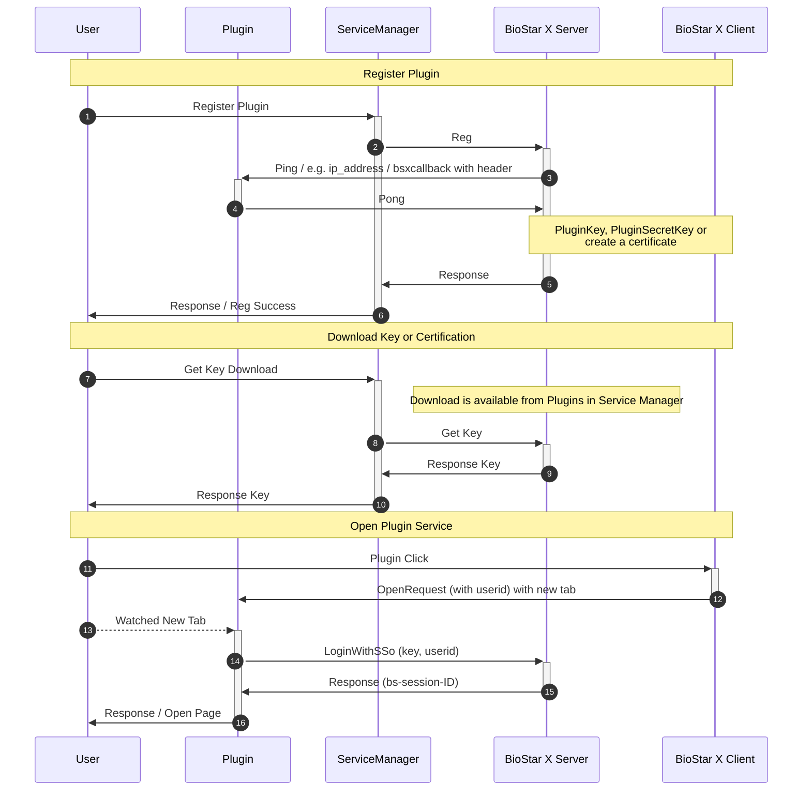

BioStar X와 연동되는 플러그인을 개발하기 위한 기본 준비사항과 개념을 안내합니다.

## 시작하기 전에

### 필요한 사전 지식

- **HTTP REST API 개발 경험**: 웹 서비스 개발 및 API 통신에 대한 기본 이해

- **RSA 공개키 암호화 이해**: 비대칭 암호화 방식에 대한 기본 지식

- **AES 대칭키 암호화 이해**: 대칭 암호화 방식에 대한 기본 지식

- **웹 서버 개발 경험**: Python FastAPI, Node.js Express, Java Spring Boot 등

### 개발 환경 요구사항

- **BioStar X 서버**: 테스트용 BioStar X 환경

- **개발용 웹 서버**: 플러그인을 호스팅할 웹 서버

- **HTTP 클라이언트**: curl, Postman 등 API 테스트 도구

## 플러그인 아키텍처

BioStar X 플러그인은 다음과 같은 구조로 동작합니다.

:::note

Key 또는 인증서는 한번 다운로드 후 재발급하지 않는 이상 다시 다운로드할 수 없습니다.

:::

## 플러그인 동작 개요

BioStar X 플러그인 시스템은 크게 세 단계로 동작합니다.

1. **플러그인 등록**: Service Manager에서 플러그인 서버 등록 및 접근성 확인

1. **인증서 관리**: Session Bridge 사용 시 보안 통신을 위한 키 관리

1. **플러그인 실행**: 사용자가 플러그인 접근 시 자동 세션 브리지를 통한 인증

각 단계의 구체적인 구현 방법은 [개발 가이드](./development-guide)를 참고하세요.