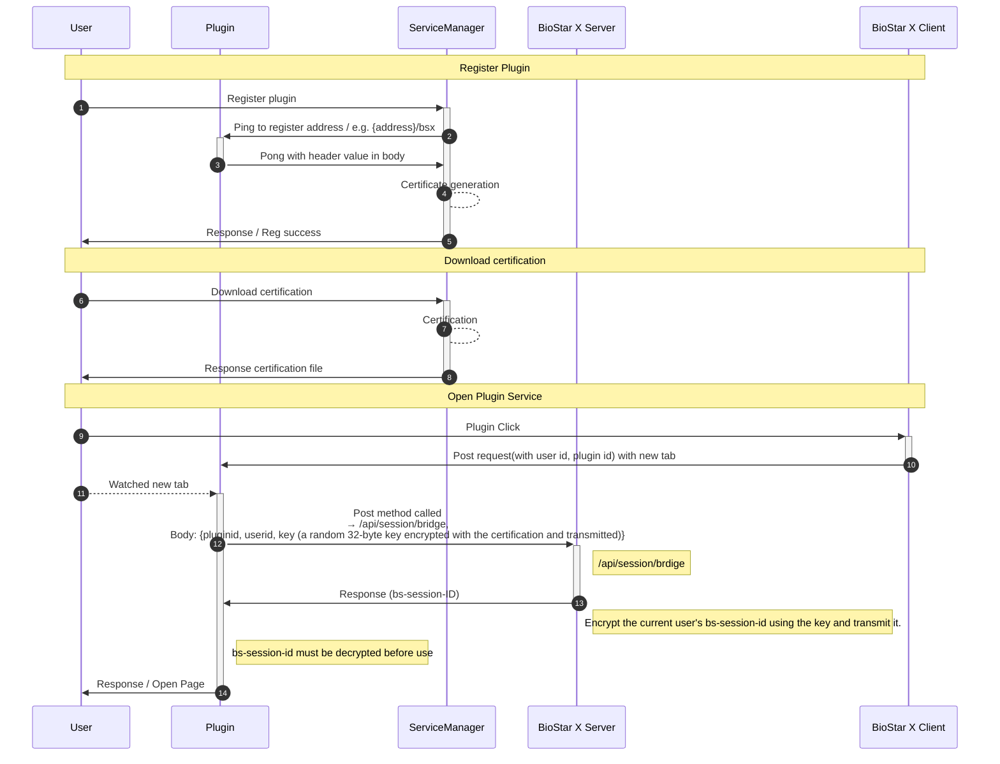

This provides the basic requirements and concepts for developing plugins that integrate with **BioStar X**.

## Before start

### Necessary prior knowledge

* **HTTP REST API development experience**: Basic understanding of web service development and API communication

* **Understanding RSA public key encryption**: Basic knowledge of asymmetric encryption methods

* **Understanding AES symmetric key encryption**: Basic knowledge of symmetric encryption methods

* **Web server development experience**: Python FastAPI, Node.js Express, Java Spring Boot, etc.

### Development environment requirements

* **BioStar X server**: Test **BioStar X** environment

* **Development web server**: Web server to host the plugin

* **HTTP client**: API testing tools like curl, Postman, etc.

## Plugin architecture

**BioStar X** plugin operates with the following structure.

:::note

The key or certificate cannot be downloaded again unless reissued after being downloaded once.

:::

## Plugin operation overview

The **BioStar X** plugin system operates in three main stages.

1. **Plugin registration**: Registering the plugin server in the Service Manager and checking accessibility

2. **Certificate management**: Key management for secure communication using Session Bridge

3. **Plugin execution**: Authentication through automatic session bridge when the user accesses the plugin

For specific implementation methods at each stage, refer to the [development guide](./development-guide).

:::info

Certificates can be downloaded from the details page of the corresponding plugin after plugin registration. If you lose the certificate, you can download it again. At this time, the existing certificate will be invalidated.

:::
