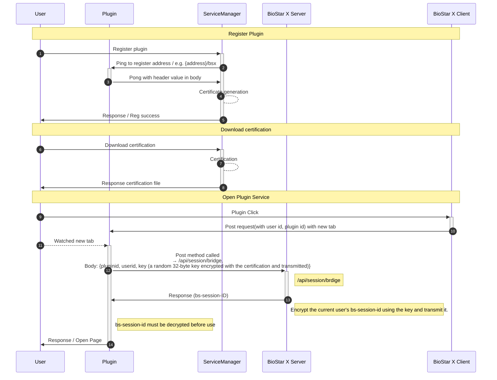

Esto proporciona los requisitos y conceptos básicos para desarrollar complementos que se integren con **BioStar X**.

## Antes de comenzar

### Conocimientos previos necesarios

* **Experiencia en desarrollo de API REST HTTP**: comprensión básica del desarrollo de servicios web y la comunicación por API

* **Comprensión del cifrado de clave pública RSA**: conocimientos básicos de los métodos de cifrado asimétrico

* **Comprensión del cifrado de clave simétrica AES**: conocimientos básicos de los métodos de cifrado simétrico

* **Experiencia en desarrollo de servidores web**: Python FastAPI, Node.js Express, Java Spring Boot, etc.

### Requisitos del entorno de desarrollo

* **Servidor BioStar X**: entorno de prueba de **BioStar X**

* **Servidor web de desarrollo**: servidor web para alojar el complemento

* **Cliente HTTP**: herramientas para probar la API como curl, Postman, etc.

## Arquitectura del complemento

El complemento de **BioStar X** funciona con la siguiente estructura.

:::note

La clave o el certificado no se pueden volver a descargar a menos que se vuelvan a emitir después de haber sido descargados una vez.

:::

## Descripción general del funcionamiento del complemento

El sistema de complementos de **BioStar X** opera en tres etapas principales.

1. **Registro del complemento**: registro del servidor del complemento en el Service Manager y verificación de la accesibilidad

2. **Gestión de certificados**: gestión de claves para una comunicación segura mediante Session Bridge

3. **Ejecución del complemento**: autenticación a través del Session Bridge automático cuando el usuario accede al complemento

Para conocer los métodos de implementación específicos en cada etapa, consulte la [guía de desarrollo](./development-guide).

:::info

Los certificados se pueden descargar desde la página de detalles del complemento correspondiente después de registrar el complemento. Si pierdes el certificado, descárgalo de nuevo. En ese momento, el certificado existente se invalidará.

:::
