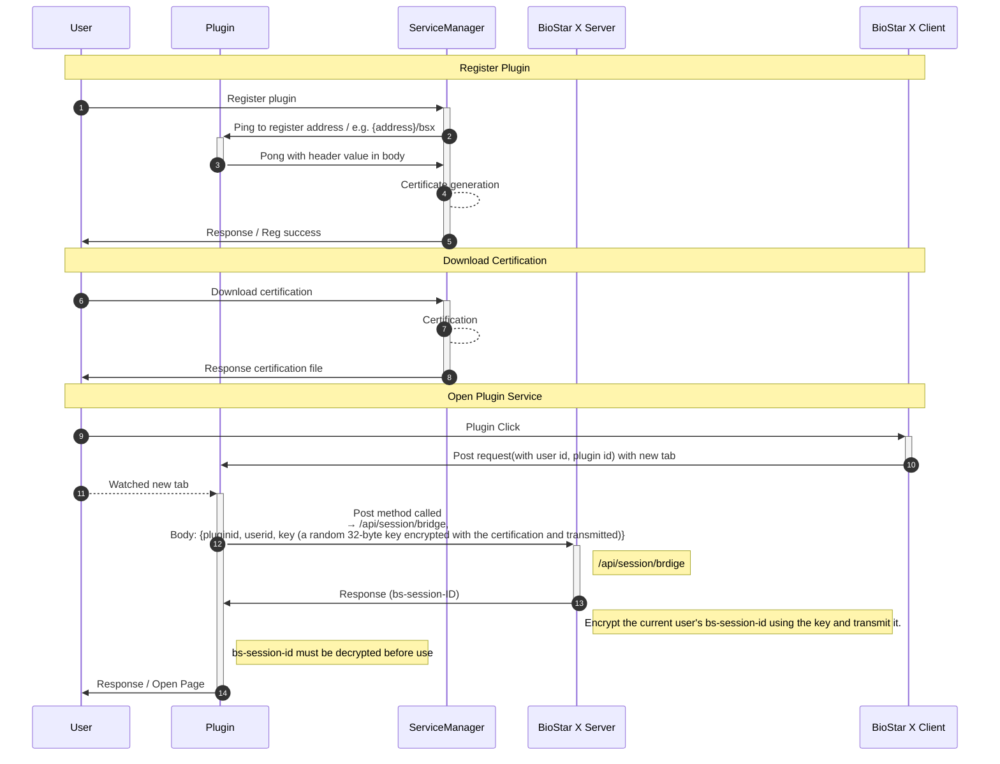

**BioStar X** と連携するプラグインを開発するための基本的な準備事項と概念を案内します。

## 開始する前に

### 必要な事前知識

* **HTTP REST API 開発経験**：Web サービス開発および API 通信に関する基本的な理解

* **RSA 公開鍵暗号化の理解**：非対称暗号方式に関する基本知識

* **AES 共通鍵暗号化の理解**：共通鍵暗号方式に関する基本知識

* **Web サーバー開発経験**：Python FastAPI、Node.js Express、Java Spring Boot など

### 開発環境の要件

* **BioStar X サーバー**：テスト用の **BioStar X** 環境

* **開発用 Web サーバー**：プラグインをホスティングする Web サーバー

* **HTTP クライアント**：curl、Postman などの API テストツール

## プラグインアーキテクチャ

**BioStar X** プラグインは次のような構造で動作します。

:::note

キーまたは証明書は、一度ダウンロードした後に再発行しない限り再ダウンロードできません。

:::

## プラグイン動作概要

**BioStar X** プラグインシステムは大きく三つの段階で動作します。

1. **プラグイン登録**：Service Manager でプラグインサーバーを登録し、接続性を確認

2. **証明書管理**：Session Bridge 使用時の安全な通信のためのキー管理

3. **プラグイン実行**：ユーザーがプラグインにアクセスすると自動セッションブリッジで認証

各段階の具体的な実装方法は [開発ガイド](./development-guide) を参照してください。

:::info

証明書はプラグイン登録後、該当プラグインの詳細ページからダウンロードできます。 証明書を紛失した場合は再度ダウンロードできます。 このとき既存の証明書は無効になります。

:::
